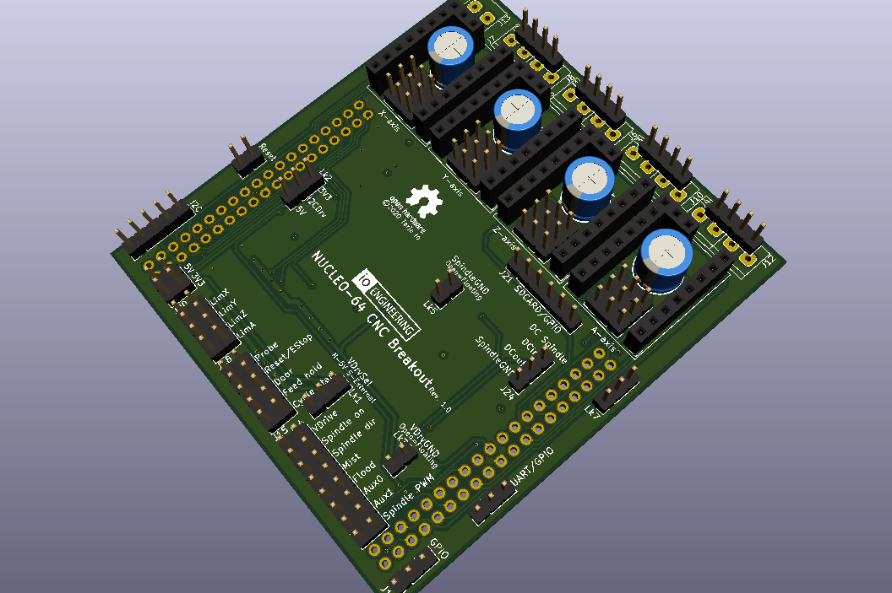

## CNC Breakout board for Nucleo-64 based development boards using ST morpho extension header

#### *** Preliminary information  ***

[grblHAL driver](https://github.com/terjeio/grblHAL/tree/master/drivers/STM32F4xx) support for [Nucleo F411RE](https://www.st.com/en/evaluation-tools/nucleo-f411re.html) and [Nucleo F4446RE](https://www.st.com/en/evaluation-tools/nucleo-f446re.html) development boards.

**NOTE:** design files are in [KiCad 5](http://www.kicad-pcb.org/) format!

**Features:**

* Four layer board

* 4-axis motor support with separate enable for all axes.

* On-board sockets for Polulu \(A4998 and DRV8825\) or Trinamic \(TMC2130, SPI mode\) style motor driver modules.

* Opto-coupled limit and signal inputs (X, Y, Z, A, Probe, Reset/E-Stop, Door, Feed Hold and Cycle Start) with 5V drive voltage.

* Opto-coupled signal outputs \(Spindle on, Spindle direction, Flood, Mist, Aux0 and Aux1\) with jumper selectable drive voltage \(5V internal or externally supplied\).
Outputs are open drain \(ULN2003\) capable of draining 500mA, enough to drive most relays directly. Outputs can be made opto-isolated via jumper settings.

* 3.3V PWM output for spindle speed control, unbuffered. Can be made buffered with choice of drive voltage.

* Optional optocoupled DC spindle output, can be made opto-isolated via jumper setting. External supply voltage.

* I2C port with jumper selectable drive voltage \(3.3V or 5V\). This is complemented with a 5V tolerant input pin that may be used as an interrupt source, eg. for a I2C-based keypad.

* Two GPIO ports, with two pins each. One is unbuffered and can be used for serial communincation, eg. for MPG or VFD control. One is input only and has 5V tolerant pins.

* Optional on-board EEPROM/FRAM for persistent storage of settings.

* SPI based SD-card interface. If not in use some or all pins may be used as GPIO or as a generic SPI interface with one chip select line, depending on motor drivers used.

---

2020-10-27
